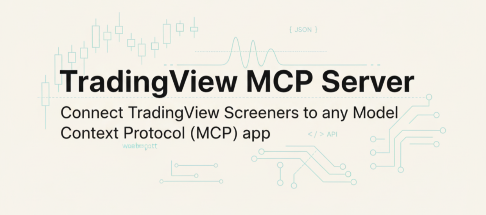

<div align="center">
  
</div>

<div align="center">

[](https://www.npmjs.com/package/tradingview-mcp-server)
[](https://www.npmjs.com/package/tradingview-mcp-server)
[](https://github.com/fiale-plus/tradingview-mcp-server/actions/workflows/test.yml)
[](LICENSE)
[](https://modelcontextprotocol.io)

**Unofficial** Model Context Protocol (MCP) server for TradingView's stock screener API.

### AI-powered investment research for patient, systematic investors.

</div>

---

## 🎯 Why Use This Tool?

This tool is designed for **curious investors** who want to explore beyond passive index investing without the complexity and competition of day trading.

### The Investment Sweet Spot

**Not for day trading** 📉
Individual traders can't compete with hedge funds, HFT algorithms, and institutional systems operating at millisecond speeds. Day trading is a zero-sum game dominated by professionals with superior technology and information.

**Not for passive index investing** 📊
If you're content with market returns through index funds (S&P 500, total market ETFs), that's excellent - but you don't need screening tools. Just buy and hold.

**Perfect for systematic, research-driven investing** 🔍
This tool is for investors who:
- Want to **explore higher alpha strategies** than passive investing
- Are **curious to learn** different investment approaches (value, growth, quality, momentum)
- Seek **better risk-adjusted returns** through systematic stock selection
- Prefer **multi-month to multi-year investment horizons** without intraday stress
- Want to **test investment hypotheses** using fundamental and technical data
- Value **systematic screening** over gut feelings and tips

### Your Edge: Time, Research, and Patience

Unlike hedge funds competing on speed and information access, you can compete on:
- **Patience** - Hold positions through volatility without quarterly reporting pressure
- **Research depth** - Screen comprehensively with 75+ fundamental and technical fields
- **Strategy experimentation** - Test different approaches (quality, value, growth, momentum)
- **Risk management** - Build diversified portfolios with systematic criteria

**This tool helps you find opportunities, understand metrics, and make informed decisions - not chase minute-by-minute price movements.**

---

## Table of Contents

- [Features](#features)
- [Installation](#installation)
- [Configuration](#configuration)
- [Try It Out: Included Commands](#try-it-out-included-commands)
- [Quick Start](#quick-start)
- [Documentation](#documentation)
- [Available Tools](#available-tools)
- [Important Notes](#important-notes)
- [Contributing](#contributing)
- [License](#license)

## Features

**Built for research-driven investment discovery:**

- 🔍 **Multi-asset screening** - Dedicated tools for stocks, forex, crypto, and ETFs with advanced filters
- 📊 **75+ investment metrics** - Fundamental (valuation, margins, returns), technical (RSI, moving averages), and performance fields with TTM/FQ/FY variants
- 🎯 **7 proven strategies & presets** - Pre-configured screens for quality, value, dividend, momentum, growth investing, plus global market indexes
- 💡 **AI-powered exploration** - Natural language queries through Claude ("Find undervalued companies with strong balance sheets")
- 💰 **Deep financial analysis** - EV, EV/EBIT, EV/EBITDA, PEG, gross/operating margins, ROIC, ROA, ROE
- ⚡ **Research-optimized** - Minimal (7 fields) for quick scans vs extended (35 fields) for comprehensive analysis
- 🏦 **Exchange filtering** - Focus on NASDAQ, NYSE, CBOE, or primary listings only
- 🌍 **Global coverage** - Screen stocks across multiple markets (America, Europe, Asia) and 9,000+ cryptocurrencies

## Installation

### Option 1: NPM (Recommended)

```bash
npm install -g tradingview-mcp-server
```

### Option 2: Clone Repository (with demo commands)

```bash
git clone https://github.com/fiale-plus/tradingview-mcp-server.git
cd tradingview-mcp-server
npm install

# Quick setup - creates project-level MCP config
./local-setup.sh          # Linux/Mac
local-setup.bat           # Windows

# Restart Claude Code and try: /market-regime or /run-screener
```

## Configuration

### Claude Desktop

Add to your Claude config file (`~/Library/Application Support/Claude/claude_desktop_config.json` on Mac):

```json
{
  "mcpServers": {
    "tradingview": {
      "command": "npx",
      "args": ["-y", "tradingview-mcp-server"]
    }
  }
}
```

### Claude Code

Create `.mcp.json` in your project root:

```json
{
  "mcpServers": {
    "tradingview": {
      "command": "npx",
      "args": ["-y", "tradingview-mcp-server"]
    }
  }
}
```

Enable in `.claude/settings.local.json`:

```json
{
  "enableAllProjectMcpServers": true
}
```

**Optional environment variables:**
- `CACHE_TTL_SECONDS` - Cache duration (default: 300)
- `RATE_LIMIT_RPM` - Requests per minute (default: 10)

## Try It Out: Included Commands

The repository includes two ready-to-use Claude Code commands that demonstrate practical workflows:

### `/market-regime` - Check Market Health

Quickly assess overall market conditions by analyzing major indexes relative to their all-time highs.

```bash
# In Claude Code, run:
/market-regime
```

**What you get:**
- Color-coded status table (🟢/🟡/🔴) for Nasdaq, OMX Stockholm 30, and Nikkei 225
- Drawdown calculations from all-time highs
- Market regime summary (bull/correction/bear)
- Use before making new allocations or for weekly portfolio reviews

### `/run-screener` - Interactive Stock Screening

Run pre-configured screening strategies and save results to CSV for further analysis.

```bash
# In Claude Code, run:
/run-screener
```

**What you get:**
- Interactive preset selection (quality, value, dividend, momentum, growth)
- Summary table of top results with key metrics
- Complete results saved to `docs/local/screening-runs/{preset}_{timestamp}.csv`
- Perfect for building watchlists and learning different investment styles

**First-time setup:**
```bash
# Quick setup script (recommended)
./local-setup.sh          # Linux/Mac
local-setup.bat           # Windows

# Or manually copy files:
cp .mcp.json.example .mcp.json
cp .claude/settings.json.example .claude/settings.local.json

# Restart Claude Code to load MCP server and commands
```

See [`.claude/commands/README.md`](.claude/commands/README.md) for detailed command documentation.

---

## Quick Start

### Learning Investment Strategies

Explore proven investment approaches with pre-configured strategies:

```
I want to learn about quality investing - show me quality stocks
```

```
Find dividend stocks that could provide steady income
```

```
What makes a good value investment? Screen for undervalued companies
```

### Research-Driven Stock Selection

Build your investment thesis systematically:

```
Find companies with:
- Strong return on equity (>15%)
- Reasonable valuation (P/E < 25)
- Significant scale (market cap > $1B)
- Low debt levels
```

```
I'm interested in profitable companies trading below their intrinsic value.
Screen for stocks with EV/EBITDA < 10 and positive free cash flow.
```

### Understanding Investment Metrics

```
What financial metrics can I use for fundamental analysis?
```

```
Explain the difference between P/E ratio and PEG ratio
```

```
What's the difference between gross margin and operating margin?
```

## Documentation

### 📚 Comprehensive Guides

- **[Preset Strategies](docs/presets.md)** - All 7 preset strategies with detailed criteria, use cases, and examples
- **[Field Reference](docs/fields.md)** - Complete guide to all 75+ fields with descriptions and usage examples
- **[Development Guide](docs/development.md)** - Local setup, testing, and extending the server

### 🔧 Advanced Topics

- **[Field Variants (TTM/FQ/FY)](docs/fields.md#understanding-field-variants)** - Understanding time periods
- **[Column Optimization](docs/presets.md#performance-characteristics)** - Minimal vs extended column sets
- **[Custom Presets](docs/development.md#creating-new-presets)** - Creating your own screening strategies

## Available Tools

### `screen_stocks`

Screen stocks based on filters.

**Parameters:**
- `filters` - Array of filter conditions (field, operator, value)
- `markets` - Markets to scan (default: `["america"]`)
- `sort_by` - Field to sort by (default: `"market_cap_basic"`)
- `sort_order` - `"asc"` or `"desc"` (default: `"desc"`)
- `limit` - Number of results (1-200, default: 20)
- `columns` - Optional array of columns to return (default: minimal 7 fields for performance)

**Operators:**
- `greater`, `less`, `greater_or_equal`, `less_or_equal`
- `equal`, `not_equal`
- `in_range` - For value ranges like `[45, 65]`
- `match` - For text search

### `list_fields`

List available fields for filtering.

**Parameters:**
- `asset_type` - `"stock"`, `"forex"`, or `"crypto"` (default: `"stock"`)
- `category` - `"fundamental"`, `"technical"`, or `"performance"` (optional)

### `get_preset`

Get a pre-configured screening strategy.

**Available Presets:**
- `quality_stocks` - Conservative quality (ROE >12%, low debt, low volatility)
- `value_stocks` - Undervalued (P/E <15, P/B <1.5)
- `dividend_stocks` - High yield (>3%, low debt)
- `momentum_stocks` - Technical strength (RSI 50-70, golden cross)
- `growth_stocks` - High growth (ROE >20%, margins >15%)
- `quality_growth_screener` - Comprehensive 16-filter screen with 35 extended columns

See **[Preset Strategies Guide](docs/presets.md)** for detailed criteria and usage.

### `list_presets`

List all available preset strategies.

### `screen_forex`

Screen forex pairs based on technical criteria.

**Parameters:**
- `filters` - Array of filter conditions (field, operator, value)
- `sort_by` - Field to sort by (default: `"volume"`)
- `sort_order` - `"asc"` or `"desc"` (default: `"desc"`)
- `limit` - Number of results (1-200, default: 20)

**Example fields:** `close`, `volume`, `change`, `RSI`, `SMA50`, `SMA200`, `Volatility.M`

### `screen_crypto`

Screen cryptocurrencies based on technical and market criteria.

**Parameters:**
- `filters` - Array of filter conditions (field, operator, value)
- `sort_by` - Field to sort by (default: `"market_cap_basic"`)
- `sort_order` - `"asc"` or `"desc"` (default: `"desc"`)
- `limit` - Number of results (1-200, default: 20)

**Example fields:** `close`, `market_cap_basic`, `volume`, `change`, `Perf.1M`, `Perf.3M`, `Perf.Y`

### `screen_etf`

Screen ETFs (Exchange-Traded Funds) based on performance and technical criteria.

**Parameters:**
- `filters` - Array of filter conditions (field, operator, value)
- `markets` - Markets to scan (default: `["america"]`)
- `sort_by` - Field to sort by (default: `"market_cap_basic"`)
- `sort_order` - `"asc"` or `"desc"` (default: `"desc"`)
- `limit` - Number of results (1-200, default: 20)
- `columns` - Optional array of columns to return

**Example fields:** `close`, `volume`, `change`, `Perf.1M`, `Perf.Y`, `RSI`, `beta_1_year`

### `lookup_symbols`

Look up specific symbols (stocks, indexes, ETFs) by ticker. **Use this for market indexes** like TVC:SPX, TVC:DJI, OMXSTO:OMXS30 that cannot be found via screening.

**Parameters:**
- `symbols` - Array of ticker symbols (e.g., `["TVC:SPX", "NASDAQ:AAPL", "OMXSTO:OMXS30"]`). Maximum 100 symbols.
- `columns` - Optional array of columns to include

**Default columns:** `name`, `close`, `change`, `volume`, `market_cap_basic`, `all_time_high`, `all_time_low`, `price_52_week_high`, `price_52_week_low`

**Use Cases:**
- **Market regime analysis** - Check if indexes are at all-time highs
- **Direct symbol lookup** - Faster than screening for known tickers
- **Portfolio comparison** - Compare your holdings side-by-side
- **Benchmark analysis** - Compare against market indexes

**Example:** Get S&P 500, Nasdaq, and OMX Stockholm 30 with market regime data
```javascript
lookup_symbols({
  symbols: ["TVC:SPX", "TVC:IXIC", "OMXSTO:OMXS30"],
  columns: ["close", "all_time_high", "price_52_week_high", "Perf.Y", "RSI"]
})
```

## Key Features at a Glance

### 75+ Available Fields

The server provides comprehensive coverage across categories:

- **Fundamental** - Core metrics (ROE, P/E, P/B), valuation (EV, EV/EBIT, PEG), margins (gross, operating, pre-tax), returns (ROA, ROIC), balance sheet (debt, assets, current ratio)
- **Technical** - RSI, moving averages (SMA50, SMA200), volatility, beta
- **Performance** - Price, volume, growth metrics, sector/industry

See **[Complete Field Reference](docs/fields.md)** for all 75+ fields with descriptions and examples.

### 7 Preset Strategies

Pre-configured screens for common investment strategies:

| Preset | Style | Key Criteria | Columns |
|--------|-------|--------------|---------|
| `quality_stocks` | Conservative | ROE >12%, low debt, low volatility | 7 default |
| `value_stocks` | Value | P/E <15, P/B <1.5 | 7 default |
| `dividend_stocks` | Income | Yield >3%, low debt | 7 default |
| `momentum_stocks` | Momentum | RSI 50-70, golden cross | 7 default |
| `growth_stocks` | Growth | ROE >20%, margins >15% | 7 default |
| `quality_growth_screener` | Comprehensive | 16 filters, deep analysis | 35 extended |
| `market_indexes` | Market Regime | 13 global indexes (US, EU, Asia) | 16 extended |

See **[Preset Strategies Guide](docs/presets.md)** for detailed criteria, use cases, and examples.

## Important Notes

⚠️ **Unofficial API**: This server uses TradingView's unofficial scanner API. It may change without notice.

- No authentication required
- Same access level as TradingView website without login
- No official documentation or support from TradingView
- Use responsibly with rate limiting

## Investment Focus & Limitations

This tool is designed for **research and position selection**, not intraday trading:

- **Current fundamentals snapshot** - Latest quarterly/annual data for investment decisions (no tick-by-tick historical data needed)
- **Research-paced rate limits** - Conservative default (10 req/min) supports thorough analysis, not high-frequency trading
- **Strategic timeframes** - Daily/weekly data updates align with multi-month investment horizons
- **Fundamental-first approach** - Emphasizes financial metrics over intraday price action

**By design**, this tool doesn't support:
- Real-time tick data or intraday charts (not needed for position investing)
- High-frequency screening (research takes time and thought)
- Options chains or derivatives (focused on equity fundamentals)
- News feeds or sentiment analysis (focus on numbers and metrics)

## Contributing

Contributions are welcome! Please feel free to submit a Pull Request.

For development setup and guidelines, see the **[Development Guide](docs/development.md)**.

## License

MIT License - see [LICENSE](LICENSE) file for details.

## Disclaimer

**Not Investment Advice**

This tool provides stock screening capabilities for informational and educational purposes only. It is **not investment advice, financial advice, or a recommendation** to buy or sell any security.

- All investment decisions are your sole responsibility
- Past performance does not indicate future results
- Screening results do not constitute investment recommendations
- Always conduct your own research and due diligence
- Consult qualified financial advisors before making investment decisions
- You may lose money investing in securities

**Software License**

This software is provided "AS IS" under the [MIT License](LICENSE), without warranty of any kind, express or implied. The authors and contributors are not liable for any damages or losses arising from use of this software.

**Third-Party Services**

This is an unofficial tool and is not affiliated with, endorsed by, or connected to TradingView. Use at your own risk. TradingView's unofficial API may change without notice.

## Links

- [Model Context Protocol](https://spec.modelcontextprotocol.io)
- [TradingView](https://www.tradingview.com)
- [Claude Desktop](https://claude.ai/download)
- [Claude Code](https://docs.claude.com/claude-code)

---

**Smarter screens, not faster trades.**

Built with ❤️ using the [Model Context Protocol](https://modelcontextprotocol.io)
