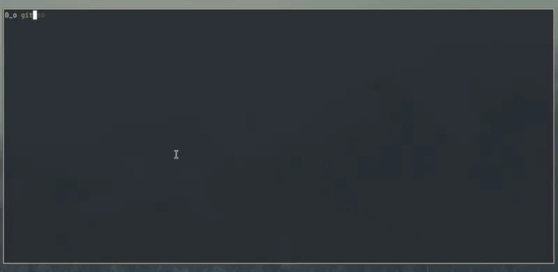

<div align="center">
  
</div>

<div align="center">

[](https://www.npmjs.com/package/tradingview-mcp-server)
[](https://www.npmjs.com/package/tradingview-mcp-server)
[](https://github.com/fiale-plus/tradingview-mcp-server/actions/workflows/test.yml)
[](LICENSE)
[](https://modelcontextprotocol.io)

**Unofficial** MCP server **and CLI** for TradingView's market screener API — stocks, forex, crypto & ETFs.

### AI-powered investment research for patient, systematic investors.

**Two modes, one package:** Use as an MCP server with Claude, or as a standalone CLI tool that pipes to `jq`, `csvtool`, or any Unix workflow.

</div>

---

## Table of Contents

- [Features](#features)
- [Installation](#installation)
- [CLI Usage](#cli-usage)
- [Configuration](#configuration)
- [MCP Tools](#mcp-tools)
- [Screening Fields](#screening-fields)
- [Pre-built Strategies](#pre-built-strategies)
- [Investor Commands](#investor-commands)
- [Operators](#operators)
- [Development](#development)
- [Disclaimer](#disclaimer)

---

## Features

- **Dual mode: MCP + CLI** — use as an MCP server with Claude or as a standalone `tradingview-cli` command
- **100+ screener fields** including Piotroski F-Score, Altman Z-Score, Graham Number, analyst consensus, and dividend growth streaks
- **18 filter operators** including `crosses_above` / `crosses_below` for golden cross detection
- **14 pre-built strategies** covering value, growth, quality, GARP, deep value, breakouts, compounders, and macro monitoring
- **9 investor workflow commands** — from `/due-diligence` to `/macro-dashboard` — built on top of the MCP tools
- **Multi-asset coverage** — stocks, ETFs, forex, and crypto with asset-specific field discovery via `list_fields`
- **Smart caching and rate limiting** — configurable TTL and requests-per-minute to keep usage responsible

---

## Installation

### Option 1: NPM (Recommended)

```bash
npm install -g tradingview-mcp-server
```

### Option 2: Clone Repository (includes demo commands)

```bash
git clone https://github.com/fiale-plus/tradingview-mcp-server.git
cd tradingview-mcp-server
npm install

# Quick setup — creates project-level MCP config
./local-setup.sh          # Linux/Mac
local-setup.bat           # Windows

# Restart Claude Code and try: /market-regime or /run-screener
```

---

## CLI Usage

After installing the package, the `tradingview-cli` command is available globally:

```bash
# List all pre-built screening strategies
tradingview-cli presets

# Screen stocks using a preset
tradingview-cli screen stocks --preset quality_stocks --limit 10

# Screen with custom filters
tradingview-cli screen stocks --filters '[{"field":"price_earnings_ttm","operator":"less","value":15}]'

# Look up specific symbols (indexes, stocks)
tradingview-cli lookup NASDAQ:AAPL TVC:SPX NYSE:MSFT

# Discover available screening fields
tradingview-cli fields --asset-type stock --category fundamental
```

### Output Formats

```bash
# JSON (default) — pipe to jq
tradingview-cli screen stocks --preset value_stocks | jq '.stocks[].name'

# CSV — pipe to file or csvtool
tradingview-cli screen stocks --preset value_stocks -f csv > results.csv

# Table — human-readable terminal output
tradingview-cli screen stocks --preset value_stocks -f table
```

### CLI Commands

| Command | Description |
|---|---|
| `screen stocks [opts]` | Screen stocks by fundamental/technical criteria |
| `screen forex [opts]` | Screen forex pairs |
| `screen crypto [opts]` | Screen cryptocurrencies |
| `screen etf [opts]` | Screen ETFs |
| `lookup <symbols...>` | Look up specific symbols by ticker |
| `fields [opts]` | List available screening fields |
| `preset <name>` | Get a preset strategy's details |
| `presets` | List all available presets |

### Screen Options

| Flag | Description |
|---|---|
| `--filters <json>` | Filter array as JSON string |
| `--preset <name>` | Load a preset (merges with `--filters`) |
| `--markets <market>` | Market to screen (repeatable, stocks/etf only) |
| `--sort-by <field>` | Sort by field |
| `--sort-order <asc\|desc>` | Sort direction |
| `--limit <n>` | Max results (1-200, default 20) |
| `--columns <col>` | Columns to include (repeatable) |
| `-f, --format <fmt>` | Output: `json`, `csv`, or `table` |

---

## Configuration

### Claude Desktop

Add to `~/Library/Application Support/Claude/claude_desktop_config.json` on Mac:

```json
{
  "mcpServers": {
    "tradingview": {
      "command": "npx",
      "args": ["-y", "tradingview-mcp-server"]
    }
  }
}
```

### Claude Code

Create `.mcp.json` in your project root:

```json
{
  "mcpServers": {
    "tradingview": {
      "command": "npx",
      "args": ["-y", "tradingview-mcp-server"]
    }
  }
}
```

Enable in `.claude/settings.local.json`:

```json
{
  "enableAllProjectMcpServers": true
}
```

### Environment Variables

| Variable | Default | Description |
|---|---|---|
| `CACHE_TTL_SECONDS` | `300` | How long to cache API responses (seconds) |
| `RATE_LIMIT_RPM` | `10` | Maximum API requests per minute |

---

## MCP Tools

Eight tools are exposed to Claude:

| Tool | Description | Key Parameters |
|---|---|---|
| `screen_stocks` | Screen stocks by fundamental and technical criteria | `filters`, `markets`, `sort_by`, `limit`, `columns` |
| `screen_forex` | Screen forex pairs by technical criteria | `filters`, `sort_by`, `limit` |
| `screen_crypto` | Screen cryptocurrencies by market and technical criteria | `filters`, `sort_by`, `limit` |
| `screen_etf` | Screen ETFs by performance and technical criteria | `filters`, `markets`, `sort_by`, `limit` |
| `lookup_symbols` | Direct lookup by ticker — required for indexes like `TVC:SPX` | `symbols` (up to 100), `columns` |
| `list_fields` | Discover available fields for any asset type | `asset_type` (`stock`, `forex`, `crypto`, `etf`), `category` |
| `get_preset` | Retrieve a pre-configured screening strategy by key | `preset_name` |
| `list_presets` | List all available preset strategies with descriptions | — |

### Filter Structure

All screening tools accept filters in this shape:

```json
{ "field": "return_on_equity", "operator": "greater", "value": 15 }
{ "field": "RSI", "operator": "in_range", "value": [40, 65] }
{ "field": "SMA50", "operator": "crosses_above", "value": "SMA200" }
{ "field": "exchange", "operator": "in_range", "value": ["NASDAQ", "NYSE"] }
```

Cross-field comparison (second example above) enables golden cross / death cross detection without needing a value on the right-hand side.

---

## Screening Fields

Use `list_fields` to browse fields. Pass `asset_type` to get tailored lists for each asset class.

### Stocks (~80 fields)

**Valuation**
`price_earnings_ttm`, `price_book_fq`, `price_sales_current`, `enterprise_value_current`, `enterprise_value_ebitda_ttm`, `enterprise_value_to_ebit_ttm`, `price_earnings_growth_ttm` (PEG), `ebitda`

**Profitability & Returns**
`return_on_equity`, `return_on_assets`, `return_on_invested_capital_fq`, `gross_margin_ttm`, `operating_margin_ttm`, `net_margin_ttm`, `after_tax_margin`, `pre_tax_margin_ttm`, `free_cash_flow_margin_ttm`

**Growth**
`total_revenue_yoy_growth_ttm`, `earnings_per_share_diluted_yoy_growth_ttm`, `revenue_per_share_ttm`, `total_revenue`, `net_income`, `earnings_per_share_diluted_ttm`

**Balance Sheet**
`debt_to_equity`, `total_debt`, `total_assets`, `current_ratio`, `free_cash_flow_ttm`, `free_cash_flow_fq`

**Dividends**
`dividend_yield_recent`, `dividends_yield_current`, `dividend_payout_ratio_ttm`, `continuous_dividend_payout_years`, `dps_yoy_growth_ttm`

**Composite Scores** (unique differentiators)

| Field | Description |
|---|---|
| `piotroski_f_score_ttm` | 0–9 financial strength composite. Score ≥7 = strong, ≤2 = weak |
| `altman_z_score_ttm` | Bankruptcy predictor. >2.99 = safe, 1.81–2.99 = grey zone, <1.81 = distress |
| `graham_numbers_ttm` | Intrinsic value = sqrt(22.5 × EPS × BVPS). Price below = undervalued |

**Analyst Data**
`Recommend.All` (composite −1 to +1), `analyst_recommendations_buy`, `analyst_recommendations_sell`, `analyst_recommendations_neutral`, `price_target_average`, `price_target_high`, `price_target_low`

**Technical**
`RSI`, `SMA50`, `SMA200`, `EMA10`, `VWAP`, `ATR`, `ADX`, `Volatility.M`, `beta_1_year`, `beta_3_year`, `beta_5_year`, `Recommend.MA`, `Recommend.Other`

**Performance & Price Levels**
`close`, `change`, `volume`, `average_volume_90d_calc`, `average_volume_30d_calc`, `relative_volume_10d_calc`, `Perf.5D`, `Perf.W`, `Perf.1M`, `Perf.3M`, `Perf.6M`, `Perf.Y`, `Perf.YTD`, `Perf.3Y`, `Perf.5Y`, `Perf.10Y`, `Perf.All`, `price_52_week_high`, `price_52_week_low`, `all_time_high`, `all_time_low`, `High.All`

**Metadata**
`sector`, `industry`, `exchange`, `market`, `is_primary`, `indexes`, `fundamental_currency_code`, `earnings_release_next_trading_date_fq`

### ETFs
`expense_ratio`, `shares_outstanding`, `dividends_yield_current`, `close`, `volume`, `Perf.W` through `Perf.Y`, `RSI`, `ATR`

### Crypto
`close`, `change`, `volume`, `market_cap_basic`, `RSI`, `ATR`, `Volatility.M`, `Perf.W` through `Perf.Y`

### Forex
`close`, `change`, `volume`, `RSI`, `ATR`, `ADX`, `Volatility.D`, `SMA50`, `SMA200`, `Perf.W` through `Perf.3M`

---

## Pre-built Strategies

Retrieve any preset with `get_preset` or browse all with `list_presets`.

| Key | Name | Style | What It Screens For |
|---|---|---|---|
| `quality_stocks` | Quality Stocks (Conservative) | Quality | ROE >12%, low debt, low volatility, golden cross |
| `value_stocks` | Value Stocks | Value | P/E <15, P/B <1.5, ROE >10% |
| `dividend_stocks` | Dividend Stocks | Income | Yield >3%, large cap, D/E <1.0 |
| `momentum_stocks` | Momentum Stocks | Momentum | RSI 50–70, golden cross, 1M performance >5% |
| `growth_stocks` | Growth Stocks | Growth | ROE >20%, operating margin >15% |
| `quality_growth_screener` | Quality Growth Screener | Quality + Growth | 16 filters: ROE, margins, revenue growth, technicals, exchange filter |
| `quality_compounder` | Quality Compounders (Munger/Buffett) | Compounder | Gross margin >40%, ROIC >15%, FCF margin >15%, growing revenue |
| `garp` | GARP (Growth at Reasonable Price) | GARP | PEG <2, ROE >15%, revenue growth >10% |
| `deep_value` | Deep Value (Contrarian) | Deep Value | P/E <10, P/B <1.5, positive FCF |
| `breakout_scanner` | Breakout Scanner | Momentum | Near 52-week high, golden cross, RSI 50–75, above-average volume |
| `earnings_momentum` | Earnings Momentum | Earnings | EPS growth YoY >20%, revenue growth >10%, RSI 45–70 |
| `dividend_growth` | Dividend Growth (Compounding Income) | Dividend Growth | Yield 1–6%, payout ratio <70%, positive FCF, consecutive years paying |
| `macro_assets` | Macro Asset Monitor | Macro | VIX, DXY, 10Y yield, Gold, WTI Oil, Bitcoin — direct symbol lookup |
| `market_indexes` | Global Market Indexes | Market Regime | 13 global indexes (US, Europe, Asia, Nordic) with ATH and performance data |

---

## Investor Commands

The repository ships with 9 ready-to-use Claude Code commands in `.claude/commands/`. Clone the repo and run `./local-setup.sh` to activate them.

| Command | Usage | What It Does |
|---|---|---|
| `/market-regime` | `/market-regime` | Analyzes Nasdaq, OMX Stockholm 30, and Nikkei 225 vs ATH. Shows drawdown, RSI, and bull/correction/bear regime status |
| `/run-screener` | `/run-screener` | Interactive wizard to pick a preset strategy, run it, display a compact table, and save results to CSV |
| `/due-diligence` | `/due-diligence AAPL` | Structured due diligence report: valuation, quality, growth, balance sheet, dividends, technicals, performance, and checklist assessment |
| `/compare-peers` | `/compare-peers AAPL MSFT GOOGL` | Side-by-side comparison of 2–5 stocks across valuation, quality, growth, and momentum with category rankings |
| `/sector-rotation` | `/sector-rotation` | Screens top stocks in all 11 GICS sectors, calculates average performance, assigns Accelerating/Decelerating signals, and recommends a preset |
| `/smart-screen` | `/smart-screen` | Determines current market regime (bull/correction/bear) from SPX, then auto-selects and runs the most appropriate preset |
| `/macro-dashboard` | `/macro-dashboard` | Multi-asset snapshot: US and global indexes, VIX, DXY, 10Y yield, Gold, Oil, BTC with auto-interpreted macro signals |
| `/portfolio-risk` | `/portfolio-risk AAPL MSFT JPM XOM` | Portfolio concentration risk, sector breakdown, beta analysis, and diversification recommendations |
| `/investment-thesis` | `/investment-thesis NVDA` | Data-driven investment thesis with bull/bear case, key metrics table, technical setup, entry/exit framework, and monitoring checklist |

---

## Operators

All screening tools support the following operators in filter conditions:

| Operator | Description | Example |
|---|---|---|
| `greater` | Field > value | `return_on_equity > 15` |
| `less` | Field < value | `price_earnings_ttm < 20` |
| `greater_or_equal` | Field >= value | `close >= 10` |
| `less_or_equal` | Field <= value | `Volatility.M <= 3` |
| `equal` | Exact match | `sector = "Technology"` |
| `not_equal` | Not equal | `exchange != "OTC"` |
| `in_range` | Value within `[min, max]` or in a list | `RSI in [45, 65]` or `exchange in ["NASDAQ", "NYSE"]` |
| `not_in_range` | Value outside range or list | `RSI not_in [70, 100]` |
| `crosses` | Field crosses the reference (either direction) | `SMA50 crosses SMA200` |
| `crosses_above` | Field crosses above the reference | `SMA50 crosses_above SMA200` (golden cross) |
| `crosses_below` | Field crosses below the reference | `SMA50 crosses_below SMA200` (death cross) |
| `match` | Text contains substring | `name match "tech"` |
| `above_percent` | Field is N% above reference | `close above_percent SMA200` |
| `below_percent` | Field is N% below reference | `close below_percent SMA200` |
| `has` | Field contains value (list fields) | `indexes has "S&P 500"` |
| `has_none_of` | Field contains none of the values | filters out specific index members |
| `empty` | Field has no value | `dividend_yield_recent empty` |
| `not_empty` | Field has a value | `all_time_high not_empty` |

String fields (`sector`, `exchange`, `industry`, `market`) use `equal` for single values and `in_range` for lists.

---

## Development

```bash
npm install          # Install dependencies
npm run build        # Compile TypeScript to dist/
npm test             # Run all tests
npm run test:watch   # Run tests in watch mode
npm run dev          # Run directly with tsx (no build step)
```

Run a single test file:

```bash
npm test -- fields.test.ts
```

After making changes, restart Claude to reload the MCP server (no hot-reload).

### Adding a New Field

1. Add to `STOCK_FIELDS` in `src/tools/fields.ts` with `name`, `label`, `category`, `type`, `description`
2. Optionally add to `EXTENDED_COLUMNS` in `src/tools/screen.ts`

### Adding a New Preset

Add to `PRESETS` in `src/resources/presets.ts` with `filters`, `markets`, `sort_by`, `sort_order`, and optional `columns`.

### Adding a New Tool

1. Create implementation in `src/tools/`
2. Register in `ListToolsRequestSchema` handler in `src/index.ts`
3. Add case in `CallToolRequestSchema` handler

---

## Disclaimer

This is an **unofficial** tool. It is not affiliated with, endorsed by, or connected to TradingView. It uses TradingView's public scanner API, which may change without notice. No authentication is required; access level is the same as the TradingView website without login.

**Not investment advice.** Screening results are for informational and educational purposes only. All investment decisions are your sole responsibility. Past performance does not indicate future results. Consult qualified financial advisors before making investment decisions.

This software is provided "AS IS" under the [MIT License](LICENSE), without warranty of any kind.

---

## Links

- [Model Context Protocol](https://spec.modelcontextprotocol.io)
- [TradingView](https://www.tradingview.com)
- [Claude Desktop](https://claude.ai/download)
- [Claude Code](https://docs.claude.com/claude-code)

---

**Smarter screens, not faster trades.**

Built with the [Model Context Protocol](https://modelcontextprotocol.io)
